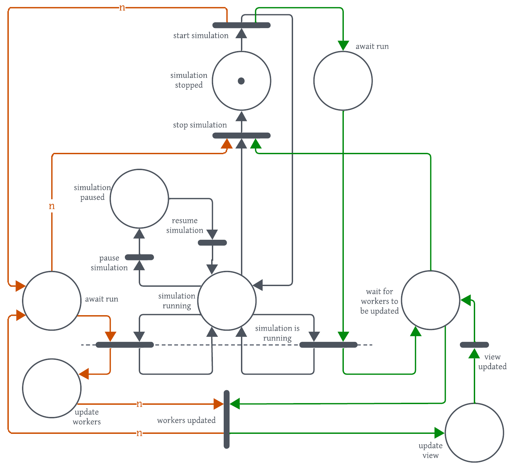
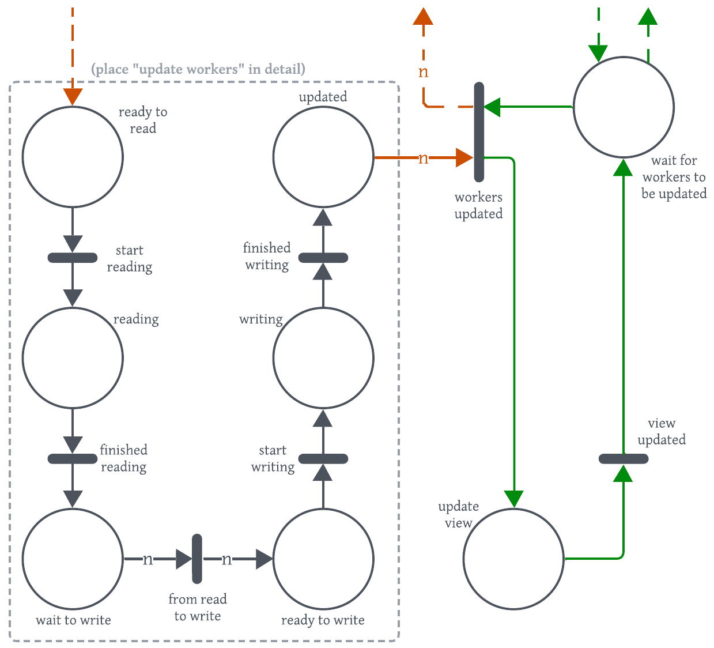

# Assignment 1

Giangiulli Chiara (1189567; chiara.giangiulli@studio.unibo.it)  
Shtini Dilaver (1189997; dilaver.shtini@studio.unibo.it)  
Terenzi Mirco (1193420; mirco.terenzi@studio.unibo.it)  
10 Aprile 2025

## Indice

- [Analisi del problema](#analisi-del-problema)
- [Design e Architettura](#design-e-architettura)
- [Comportamento del sistema](#comportamento-del-sistema)
- [Performance](#performance)
- [Verifica con Java Pathfinder](#verifica-con-java-pathfinder)

## Analisi del problema
Il problema affrontato in questo assignment è la simulazione del comportamento collettivo di boids, entità autonome che si muovono in uno spazio bidimensionale seguendo tre regole: separazione, allineamento e coesione, come introdotto da Craig Reynolds nel 1986.

Ogni boid, a ogni iterazione del ciclo di simulazione, deve:
- Analizzare la posizione e velocità di tutti gli altri boid che lo circondano.
- Calcolare la nuova velocità e aggiornare la propria posizione.

La programmazione concorrente permette di parallelizzare questi aggiornamenti, ma alcuni aspetti richiedono particolare attenzione:
- Le velocità e le posizioni di ogni boid sono calcolate in base a quelle dei suoi vicini, bisogna quindi gestire in modo sicuro l'accesso concorrente ai dati condivisi.
- Le fasi di calcolo e aggiornamento devono essere sincronizzate per evitare letture/scritture inconsistenti.
- Per un corretto calcolo della nuova posizione dei boid, è necessario che sia prima calcolata e aggiornata la velocità.
- L'interfaccia utente deve essere reattiva e sincronizzarsi con l'aggiornamento dei boids.

## Design e Architettura
Il progetto è stato strutturato seguendo il pattern MVC (Model-View-Controller), con una netta separazione tra logica della simulazione, interfaccia grafica e controllo dell'esecuzione.
Tale approccio ha consentito di gestire in modo modulare e flessibile le diverse versioni concorrenti della simulazione. Nello specifico:
- **Model** (`BoidsModel`): contiene la logica della simulazione dei _boids_, ne gestisce il mantenimento e l'aggiornamento della posizione e della velocità, secondo le regole di comportamento indicate nel progetto di Reynolds (separazione, coesione, allineamento);
- **View** (`BoidsPanel`, `BoidsView`): implementata utilizzando Swing, è responsabile della rappresentazione grafica dei boids e dell'interazione tra l'utente e il programma. Fornisce dei pulsanti per gestire l'esecuzione della simulazione (start, stop e pause/resume) e l'aggiornamento delle regole di movimento di ciascun elemento, tramite _sliders_.
- **Controller** (`BoidsController`): gestisce il ciclo di vita della simulazione e funge da ponte tra la vista e il modello,

### Versione Multithread
In questa versione, ogni boid è stato inizialmente associato a un thread dedicato. Tuttavia, questa soluzione è stata ritenuta troppo onerosa, in quanto limitata al numero di core della CPU utilizzata, e si è passati a una suddivisione dell'insieme di boids tra un sottoinsieme di thread, uno per ciascun processore disponibile sulla Java Virtual Machine (JVM).

Per gestire la sincronizzazione tra l'aggiornamento della velocità e quello della posizione, sono inizialmente state definite due _barrier_: una per ciascun aggiornamento. 
Successivamente, per migliorare le prestazioni del sistema ed evitare eccessive attese sulle barriere, l'aggiornamento dei boid è stato ripensato in modo da poter utilizzare una barriera in meno. 
In particolare, per evitare corse critiche negli accessi alla posizione e alla velocità, è stata implementata una barriera che definisse due momenti distinti nei quali accedere (read) e aggiornare (write) tali variabili.

Infine, attraverso l'utilizzo di un _monitor_, implementato utilizzando meccanismi di sincronizzazione forniti dalla libreria concorrente di Java (`ReentrantLock` e `Condition`), è stata garantita la mutua esclusione nell'aggiornamento dei pesi, quando l'utente interagisce con la GUI, e per la gestione del cambio di stato (in pausa, stop o in esecuzione).

### Versione Task-based
La concorrenza viene gestita attraverso un _thread pool_ fisso, creato tramite `ExecutorService`.
La dimensione di tale insieme è calcolato come il numero di core disponibili sulla macchina (più uno), per massimizzare l'utilizzo delle risorse di calcolo senza introdurre overhead non necessari.
All’avvio della simulazione, per ciascun boid viene creato un task indipendente che eseguito concorrentemente agli altri.
Anche in questa versione, l’architettura scelta si basa sulla divisione dei task in due tipologie, in base al loro compito: un primo gruppo che ha il compito di leggere e calcolare velocità e posizioni e un secondo gruppo che ha il compito di aggiornare le variabili con i nuovi valori.

La sincronizzazione è stata gestita sfruttando il framework `Executor`, che permette di ottenere i risultati dei task come oggetti di tipo `Future<Void>`. 
Tale classe permette di ritornare un elemento che conterrà il risultato del task, nel nostro caso, essendo di tipo `Void` non viene ritornato un risultato effettivo ma viene utilizzato per notificare la corretta esecuzione del compito del task che lo ha creato.
Inoltre, anche in questa versione viene sfruttato il monitor per la gestione dello stato globale della simulazione.

### Versione Virtual Thread
Nella versione implementata tramite i _virtual threads_ di Java, l'architettura scelta è molto simile alla versione multithreaded, ma ciascun thread è associato a un boid, il che consente di sfruttare i vantaggi dei virtual threads, come la leggerezza e la facilità di gestione della concorrenza.
Nella loro implementazione, i threads sono stati creati analogamente ai thread utilizzati nella prima versione del progetto, utilizzando due barriere per poter gestire la sincronizzazione dei boids per quanto riguarda l'aggiornamento delle loro posizioni e della velocità, dividendo l'esecuzione in una parte di scrittura e una di lettura.

## Comportamento del sistema
Il comportamento del sistema è basato principalmente su una classe `State`, la quale mantiene, tramite accessi in mutua esclusione, lo stato della simulazione.
Il diagramma riportato di seguito è una rete di Petri che rappresenta le interazioni tra le classi principali, nello specifico tra il controller, l'insieme di workers (il cui totale è $n$) e lo stato, rispettivamente in verde, arancione e nero.

L'elemento di sincronizzazione principale è rappresentato dalle transizioni _await run_, che permettono al controller e ai workers di proseguire la loro esecuzione solamente se lo stato è correttamente impostato, ossia se il token si trova nel luogo etichettato come _running_.
Nell'immagine, le due transizioni appena descritte sono collegate tramite una linea tratteggiata, non per indicare una dipendenza tra le due (ad esempio non è necessario che il controller attenda l'arrivo dei thread per poter eseguire tale transizione) ma piuttosto che si tratta dello stesso meccanismo di sincronizzazione, utilizzato da entrambi gli agenti.

	

Nel diagramma precedente la parte riguardante l'esecuzione del controller e dei workers è stata semplificata per migliorare la lettura dello schema.
Di seguito viene riportato più nel dettaglio il processo di sincronizzazione tra i due elementi, il quale avviene principalmente tramite una barriera, chiamata _boids updated_, che indica la fine dell'aggiornamento dei boids presenti nella simulazione, utilizzata dal controller per capire quando è il momento di aggiornare la vista.

Per la sincronizzazione dei boids, ciascuno identificato da un token, viene utilizzata una seconda barriera _read-to-write_ che serve definire temporalmente la parte di lettura (eseguita prima della barriera) e la parte di scrittura (eseguita dopo) descritte nei precedenti capitoli della relazione.
Tale elemento permette a più threads (o tasks) di accedere alla velocità e alla posizione dei boids evitando corse critiche.

	

## Performance
Di seguito sono riportati i risultati i dati sulla performance raccolti durante l'esecuzione del progetto su un calcolatore da 16 core.
I pesi relativi a separazione, allineamento e coesione hanno valore 1 e il test considera l'esecuzione di 1000 iterazioni.

### Speedup
Dati i seguenti tempi d'esecuzione raccolti:

|                 | 100 boids | 1000 boids | 5000 boids |
|-----------------|-----------|------------|------------|
| Sequenziale     | 42 827ms  | 41 900ms   | 520 614ms  |
| Multithreaded   | 19 304ms  | 18 933ms   | 76 706ms   |
| Task-based      | 19 417ms  | 21 634ms   | 37 369ms   |
| Virtual threads | 19 473ms  | 23 141ms   | 66 864ms   |

Lo _speedup_ è calcolato come $S = \frac{T_1}{T_n}$, dove $T_1$ è il tempo d'esecuzione della versione sequenziale, mentre $T_n$ il tempo richiesto dall'esecuzione della versione parallela, eseguita su $n$ processori:

|                 | 100 boids | 1000 boids | 5000 boids |
|-----------------|-----------|------------|------------|
| Multithreaded   | 2,218     | 2,205      | 2,199      |
| Task-based      | 2,213     | 1,936      | 1,810      |
| Virtual threads | 6,787     | 13,931     | 7,786      |

### Efficienza
Calcolata con la formula $E = \frac{S}{N}$, dove $S$ è lo speedup e $N$ il numero di processori (in questo caso 16).
L'efficienza ideale è indicata con valore 1, ossia quando tutti i processori sono utilizzati alla loro massima capacità.

|                 | 100 boids | 1000 boids | 5000 boids |
|-----------------|-----------|------------|------------|
| Multithreaded   | 0,138     | 0,138      | 0,424      |
| Task-based      | 0,137     | 0,121      | 0,870      |
| Virtual threads | 0,137     | 0,113      | 0,486      |

## Verifica con Java Pathfinder
Il codice della versione multithreaded è stato testato utilizzando [Java PathFinder (JPF)](https://en.wikipedia.org/wiki/Java_Pathfinder), un framework di verifica formale per programmi Java, utilizzato per l'esplorazione degli stati del programma e la verifica della correttezza del codice, con l'obiettivo di individuare eventuali errori di concorrenza, deadlock o violazioni di proprietà.
Per eseguire la verifica, è stato utilizzato un modello semplificato del progetto, al fine di ottimizzare i tempi di esecuzione. In particolare, è stata rimossa la parte relativa all'interfaccia grafica e il numero di boids è stato ridotto per evitare un numero elevato di stati da esplorare. Durante la fase di test, è stato
analizzato un solo ciclo di simulazione, in modo da concentrarsi sulla verifica della logica di aggiornamento dei boids e sulla gestione della concorrenza di questi ultimi tramite gli elementi di sincronizzazione implementati nel codice, come le barriere e i monitor.

Di seguito viene riportato il risultato della verifica, eseguita su un sistema con 10 core:
<pre>
<b>./gradlew runAssignment01Verify</b>

<b>> Task :runAssignment01Verify</b>
[WARNING] unknown classpath element: /Users/mirco/Developer/jpf-template-project/jpf-runner/build/examples
JavaPathfinder core system v8.0 (rev 81bca21abc14f6f560610b2aed65832fbc543994) - (C) 2005-2014 United States Government. All rights reserved.

====================================================== system under test
pcd.ass01.multithreaded.MultithreadedSimulation.main()

====================================================== search started: 04/04/25, 13:52
[WARNING] orphan NativePeer method: jdk.internal.reflect.Reflection.getCallerClass(I)Ljava/lang/Class;

====================================================== results
no errors detected

====================================================== statistics
elapsed time:       00:03:29
states:             new=1344566,visited=2395785,backtracked=3740351,end=288
search:             maxDepth=198,constraints=0
choice generators:  thread=1344566 (signal=0,lock=5378,sharedRef=1238321,threadApi=2,reschedule=8944), data=0
heap:               new=980953,released=778818,maxLive=788,gcCycles=3596188
instructions:       126859809
max memory:         504MB
loaded code:        classes=134,methods=3189

====================================================== search finished: 04/04/25, 13:55

Deprecated Gradle features were used in this build, making it incompatible with Gradle 8.0.

You can use '--warning-mode all' to show the individual deprecation warnings and determine if they come from your own scripts or plugins.

See <a href="https://docs.gradle.org/7.4/userguide/command_line_interface.html#sec:command_line_warnings">https://docs.gradle.org/7.4/userguide/command_line_interface.html#sec:command_line_warnings</a>

<b>BUILD SUCCESSFUL</b> in 3m 31s
2 actionable tasks: 2 executed
</pre>
